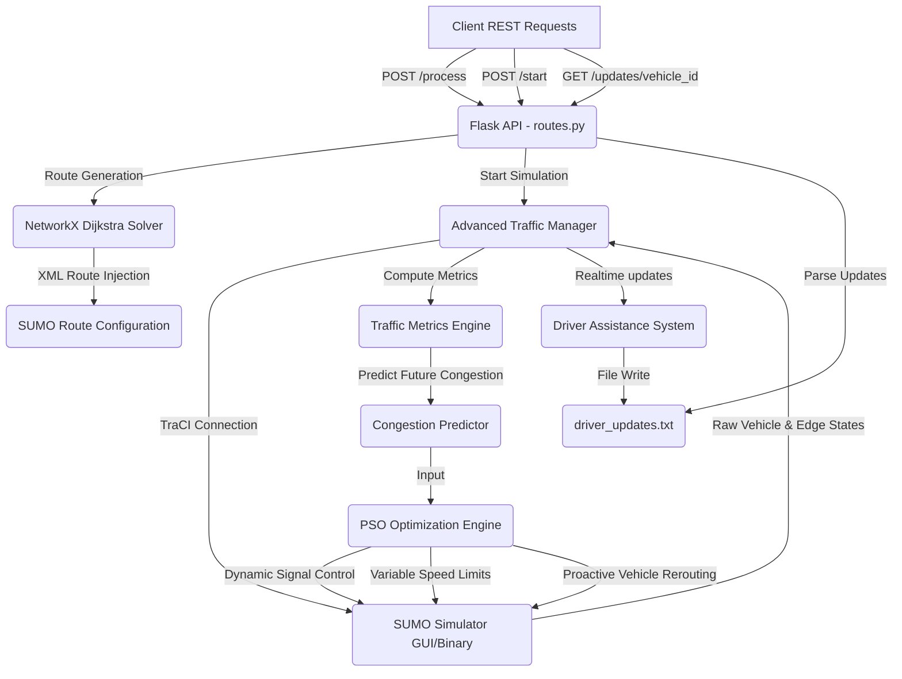

# NexRoute: Urban Traffic Optimization & Route Management

NexRoute is a production-quality, simulation-in-the-loop Traffic Optimization and Route Management system. It integrates a Python-based backend powered by SUMO (Simulation of Urban MObility), NetworkX graph algorithms, and Particle Swarm Optimization (PSO) to dynamically optimize urban traffic networks, control traffic signals, harmonize vehicle speeds, and proactively reroute vehicles to mitigate congestion.

---

## 🎯 Project Objectives & Core Vision

Urban traffic networks are highly dynamic, non-linear, and prone to gridlocks. Traditional traffic management systems rely on reactive or time-of-day plans that fail to adapt to real-time fluctuations. 

NexRoute is designed to transition traffic management from a **reactive** paradigm (responding to congestion after it has occurred) to a **proactive** and **adaptive** paradigm. By utilizing high-fidelity traffic simulations (SUMO), predicting downstream bottlenecks, and executing real-time swarm intelligence optimization (PSO), NexRoute:
1. **Minimizes overall vehicle travel time loss and delay.**
2. **Reduces queue lengths** at critical bottlenecks and signalized intersections.
3. **Harmonizes traffic flow** to prevent shockwaves and lower stop counts.
4. **Proactively reroutes vehicles** around predicted congested zones before they enter them.
5. **Provides real-time driver assistance** (upcoming turn warnings and optimal speed advisories).

---

## 🏗️ System Architecture & Data Flow

The backend is structured as a modular Flask REST server that communicates with the SUMO simulator via TraCI (Traffic Control Interface).



### Main Execution Flow:
1. **Route Registration**: The user sends an origin and destination edge via `POST /process`. The `AdvancedTrafficManager` uses a NetworkX-represented graph of the road network to calculate the shortest path, validates the route connections, writes it XML-formatted into the route file, and initializes a vehicle state tracking instance.
2. **Simulation Control**: The simulation starts via `POST /start` in a separate worker thread.
3. **Observation Loop**: At every simulation step (1.0s interval), the manager polls TraCI to update vehicle states (`VehicleState`) and edge-level traffic metrics (`TrafficMetrics`).
4. **Swarm Optimization Loop**: Every `OPTIMIZATION_INTERVAL` (default: 30 steps), the three PSO modules (Traffic Light, Speed Limit, and Routing) optimize system control parameters.
5. **Driver Assistance**: Real-time turn notifications and speed advice are updated inside `driver_updates.txt` for the active vehicles.

---

## 🧠 Core Backend Subsystems & Algorithms

### 1. Particle Swarm Optimization (PSO) Engine (`optimizer.py`)
All control subsystems leverage a highly convergent Particle Swarm Optimization (PSO) algorithm. In NexRoute, the optimizer minimizes complex, non-differentiable traffic performance objective functions.

#### Mathematical Formulation:
For each particle $i$ in the swarm:

- **Velocity Update**:

$$v_i(t+1) = w \cdot v_i(t) + c_1 \cdot r_1 \cdot (p_i - x_i(t)) + c_2 \cdot r_2 \cdot (g - x_i(t))$$

Where:
- $x_i(t)$ is the current position (candidate parameter vector).
- $v_i(t)$ is the velocity vector.
- $p_i$ is the particle's personal historical best position.
- $g$ is the swarm's global best position.
- $w$ is the inertia weight, which decays adaptively: $w(t+1) = w(t) \cdot 0.99$ to favor global exploration initially and local exploitation later.
- $c_1, c_2$ are the cognitive and social acceleration coefficients (default: $1.8$).
- $r_1, r_2 \sim U(0, 1)$ are random variables adding stochastic behavior.

- **Position Update & Clamping**:

$$x_i(t+1) = x_i(t) + v_i(t+1)$$

Positions are clamped to valid bounds with smooth reflection handling.

---

### 2. Dynamic Traffic Light Optimization (`traffic_manager.py`)
Intersections are the primary source of delays. NexRoute uses PSO to adjust traffic light phase durations dynamically based on real-time and predicted queue lengths.

- **Objective Function**: The objective function evaluates candidate signal timings by calculating a weighted penalty score across all controlled lanes.

$$\text{Score}_{\text{signal}} = \sum_{\text{phases}} \left( \frac{\text{Queue}}{\text{Lanes}} \cdot w_q \cdot 2.0 + \frac{\text{WaitingTime}}{\text{FlowRate}} \cdot w_d \cdot 1.5 + \text{StoppedVehicles} \cdot 1.2 + \text{Delays} \cdot 1.3 + (1 - \text{Efficiency}) \cdot 1.5 \right)$$

- **Phase Duration Calculation**: The optimized base green time and weights are applied to compute the phase duration:

$$D_{\text{phase}} = D_{\text{green}} + \frac{\text{Flow}}{500} \cdot w_{\text{demand}} + \text{Queue} \cdot w_{\text{queue}} \cdot 2.5 + \text{Stops} \cdot 2.0 + C_{\text{pred}} \cdot 20.0$$

*Bounds constraints*: Green times are capped between `MIN_GREEN_TIME` (20s) and `MAX_GREEN_TIME` (100s).

- **Proactive Safety Measures**: Under severe predicted congestion ($> 0.65$), the system automatically extends yellow phases (up to 1.5x) and injects all-red phases to clear intersection gridlocks.

---

### 3. Variable Speed Limits (VSL) & Speed Harmonization (`traffic_manager.py`)
To prevent "shockwaves" (propagating stop-and-go waves caused by sudden braking), NexRoute optimizes and applies variable speed limits on congested edges.

- **Objective Function**: Minimizes density, queue lengths, and speed deviations relative to the design speed limits.

- **Dynamic Speed Clamping**:

$$V_{\text{limit}} = \max\left(3.0, V_{\text{normal}} \cdot \left[ 1.0 - \left( C_{\text{pred}} \cdot 0.5 + F_{\text{queue}} \cdot 0.4 + F_{\text{density}} \cdot 0.3 + F_{\text{stop}} \cdot 0.2 \right) \right]\right)$$

Where $C_{\text{pred}}$ is the predicted congestion, $V_{\text{normal}}$ is the edge's default speed limit, and $F$ represents normalized factors.

- **Speed Harmonization**: Within a congested edge, trailing vehicles are smoothed to follow lead vehicle speeds with safety margins:

$$V_{\text{target}} = \min(V_{\text{limit}}, V_{\text{lead}} \cdot \text{gap})$$

This reduces acceleration variance, saving fuel and improving safety.

---

### 4. Proactive Routing & Adaptive Dijkstra Weights (`traffic_manager.py`)
Traditional routing utilizes static free-flow travel times. NexRoute utilizes real-time and predicted congestion to compute dynamic weights for NetworkX and TraCI routing.

- **Dynamic Weight Function**:

$$W_{\text{edge}} = \left( T_{\text{travel}} \cdot w_t + Q_{\text{delay}} + P_{\text{congestion}} + \text{Stops} \cdot 3.0 \right) \cdot F_{\text{history}} \cdot M_{\text{mult}}$$

Where:
- $T_{\text{travel}} = \frac{\text{Edge Length}}{\text{Mean Speed}}$
- $Q_{\text{delay}} = \text{QueueLength} \cdot 3.0 \cdot w_q \cdot (1.2^{\text{QueueLength}})$ (exponential queue penalty).
- $P_{\text{congestion}} = C_{\text{pred}}^2 \cdot \text{Edge Length} \cdot w_p$.
- $M_{\text{mult}} = 5.0$ if the edge's predicted congestion exceeds the adaptive routing threshold ($0.65$).

- **Routing Optimization**: PSO optimizes the weights ($w_t, w_q, w_p, w_h$) globally to minimize system travel time loss and waiting times. Candidate vehicles are dynamically rerouted via Dijkstra's shortest path before encountering the bottleneck.

---

### 5. Congestion Prediction Model (`traffic_manager.py`)
Predictive routing requires knowing where congestion *will* be, not just where it is. NexRoute computes a prediction value between $0.1$ and $0.95$ using historical and spatial features:

$$C_{\text{pred}} = 0.25 \cdot C_{\text{curr}} + 0.20 \cdot H_{\text{EMA}} + 0.15 \cdot D_{\text{norm}} + 0.15 \cdot Q_{\text{norm}} + 0.10 \cdot S_{\text{factor}} + 0.10 \cdot O_{\text{norm}} + 0.05 \cdot R_{\text{change}}$$

Where:
- $C_{\text{curr}}$: Current congestion index (flow rate / capacity).
- $H_{\text{EMA}}$: Exponential moving average of congestion history (size = 40).
- $D_{\text{norm}}$: Normalized density (Passenger Car Units / km / lane).
- $Q_{\text{norm}}$: Normalized queue factor.
- $S_{\text{factor}}$: Speed drop factor ($1 - \frac{V_{\text{avg}}}{V_{\text{limit}}}$).
- $O_{\text{norm}}$: Normalized occupancy percentage.
- $R_{\text{change}}$: Rate of congestion change over recent steps.
- **Downstream Propagation**: The prediction is blended with downstream edges ($80\%$ local, $20\%$ downstream average) to capture queue spillback dynamics.

---

### 6. Driver Assistance Subsystem (`driver_assistance.py`)
Generates localized, geometry-aware recommendations for individual vehicles.

- **Vector-Based Turn Detection**: Rather than relying on simple connectivity maps, the system calculates the geometric angle between consecutive edges in the vehicle's route:

$$v_1 = \vec{p}_{\text{end1}} - \vec{p}_{\text{start1}}$$

$$v_2 = \vec{p}_{\text{end2}} - \vec{p}_{\text{start2}}$$

$$\theta = \text{atan2}(v_1 \times v_2, v_1 \cdot v_2)$$

Angles are classified into turn types:
- $|\theta| < 25^\circ$: Straight
- $25^\circ \le \theta < 60^\circ$: Slight Left
- $60^\circ \le \theta < 150^\circ$: Left
- $\theta \ge 150^\circ$: Sharp Left
- (Symmetric negative angles map to Right, Slight Right, and Sharp Right turns).

- **Proactive Speed Guidance**: Evaluates optimal speeds using queue lengths and congestion indices of the upcoming 3 edges:

$$V_{\text{advice}} = \min(V_{\text{limit}}, V_{\text{congest}})$$

Output updates are written to `driver_updates.txt` in real time.

---

## 📂 Backend File & Module Structure

```
backend/
│
├── run.py                          # Flask entrypoint. Initializes app and routes.
├── requirements.txt                # Python package dependencies.
│
└── app/
    ├── __init__.py                 # Package setup and logging initialization.
    ├── config.py                   # System parameters, SUMO configuration paths, PSO defaults, and thresholds.
    ├── models.py                   # Data Classes: VehicleState, TrafficMetrics.
    ├── optimizer.py                # Particle Swarm Optimization core implementation.
    ├── driver_assistance.py        # Vector geometry engine for turn warnings & speed guidance.
    ├── traffic_manager.py          # NetworkX Builder, TraCI Simulation Loop, VSL, Signal Optimization, Congestion Predictor.
    └── routes.py                   # Flask REST API Endpoints.
```

### Module Descriptions:
*   **[`app/config.py`](file:///c:/Users/ghana/OneDrive/Desktop/NexRoute/backend/app/config.py)**: Contains simulation properties (such as SUMO paths), SPEED_LIMITS per road type, passenger car unit (PCU) values (e.g. Passenger = 1.0, Truck = 2.3, Bus = 2.2), and signal timing bounds.
*   **[`app/models.py`](file:///c:/Users/ghana/OneDrive/Desktop/NexRoute/backend/app/models.py)**: Defines typing and properties. `VehicleState` captures positional data, speed, acceleration, route, waiting time, and lane details. `TrafficMetrics` stores calculated parameters like density, variance, entropy, and predicted congestion.
*   **[`app/optimizer.py`](file:///c:/Users/ghana/OneDrive/Desktop/NexRoute/backend/app/optimizer.py)**: Implements particles, bounds restrictions, velocity updates, and adaptive inertia decay for the PSO optimization engine.
*   **[`app/driver_assistance.py`](file:///c:/Users/ghana/OneDrive/Desktop/NexRoute/backend/app/driver_assistance.py)**: Operates coordinates-to-angle vector conversion for ahead-of-turn alerts and performs optimal speed recommendations based on downstream queues.
*   **[`app/traffic_manager.py`](file:///c:/Users/ghana/OneDrive/Desktop/NexRoute/backend/app/traffic_manager.py)**: Builds a directed NetworkX graph, computes edge capacity according to the Highway Capacity Manual (HCM) formulas, coordinates TraCI simulation cycles, performs PSO optimizations, and manages congestion predictions.
*   **[`app/routes.py`](file:///c:/Users/ghana/OneDrive/Desktop/NexRoute/backend/app/routes.py)**: Exposes endpoints for processing route requests, starting the simulation thread, and polling driver updates.

---

## 🛠️ Installation & Setup

### Prerequisites
*   **Python 3.8+**
*   **SUMO (Simulation of Urban MObility)** installed, with the `SUMO_HOME` environment variable configured correctly:
    ```bash
    # On Windows (Example)
    set SUMO_HOME="C:\Program Files (x86)\Eclipse\Sumo"
    set PATH=%PATH%;%SUMO_HOME%\bin
    ```

### Running the Backend Server
1. Navigate to the `backend` directory:
   ```bash
   cd backend
   ```
2. Install Python packages:
   ```bash
   pip install -r requirements.txt
   ```
3. Run the Flask server:
   ```bash
   python run.py
   ```
   *The backend runs locally on `http://127.0.0.1:5000`.*

---

## 🔌 API Documentation

### 1. Health Check
* **URL**: `/`
* **Method**: `GET`
* **Response**:
  ```json
  { "message": "Traffic Optimization API is running" }
  ```

### 2. Add Vehicle Route
Calculates the optimal route and injects it into the active SUMO configuration.
* **URL**: `/process`
* **Method**: `POST`
* **Body**:
  ```json
  {
    "initial_location": "edge_id_origin",
    "destination": "edge_id_destination"
  }
  ```
* **Response**:
  ```json
  {
    "status": "success",
    "message": "Vehicle route added successfully",
    "data": {
      "from": "edge_id_origin",
      "to": "edge_id_destination",
      "vehicle_id": "vehicle_numeric_id",
      "route_length": 8,
      "route": ["edge_1", "edge_2", "edge_3", "edge_4", "edge_5", "edge_6", "edge_7", "edge_8"]
    }
  }
  ```

### 3. Start Simulation
Launches the SUMO GUI and begins the real-time simulation thread.
* **URL**: `/start`
* **Method**: `POST`
* **Response**:
  ```json
  {
    "status": "success",
    "message": "Simulation started successfully"
  }
  ```

### 4. Fetch Driver Updates
Polls the latest navigation coordinates and warnings.
* **URL**: `/updates/<vehicle_id>`
* **Method**: `GET`
* **Response**:
  ```json
  {
    "status": "success",
    "driver_updates": [
      "Prepare to turn left in 42m",
      "Maintain current speed of 12.5 m/s"
    ],
    "vehicle_state": {
      "status": "active",
      "is_arrived": false
    }
  }
  ```
