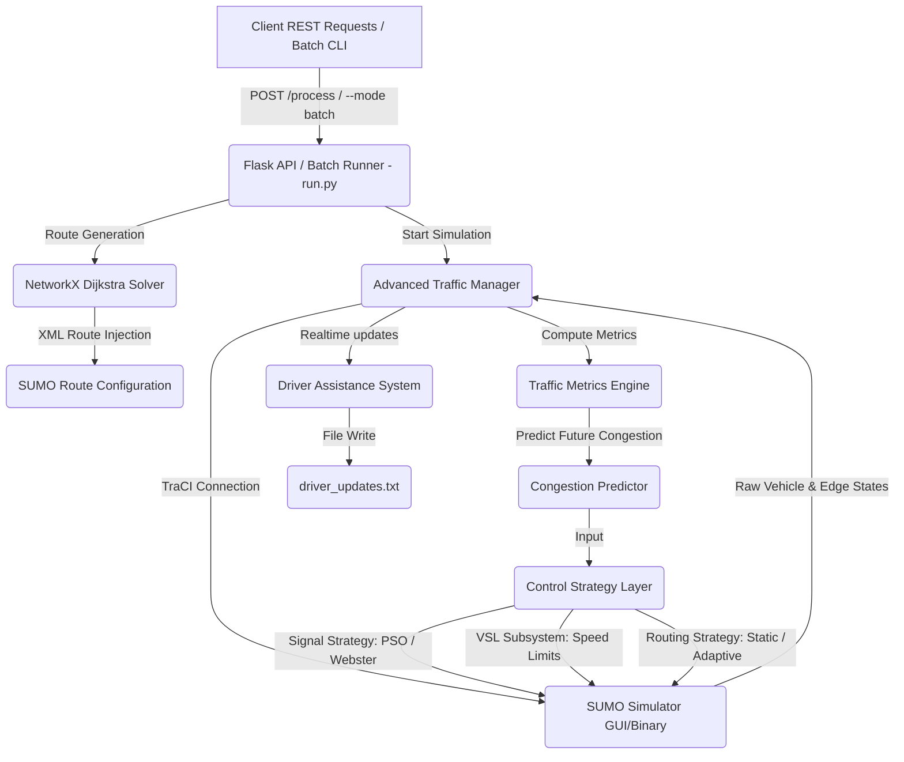

# NexRoute: Urban Traffic Optimization & Route Management

NexRoute is a simulation-in-the-loop Traffic Optimization and Route Management platform built on Python, SUMO (Simulation of Urban MObility), NetworkX graph algorithms, and Particle Swarm Optimization (PSO). It simulates urban road networks, dynamically optimizes traffic signal timings, regulates variable speed limits (VSL), and calculates adaptive vehicle routes to mitigate urban congestion.

> 📖 **Research Methodology & Experimental Design**: For a detailed specification of the research questions, 5-condition ablation matrix, scenario set, statistical hypothesis testing (paired $t$-tests, Wilcoxon, Cohen's $d$, bootstrap 95% CIs, Benjamini-Hochberg FDR), and known limitations, refer to [**`METHODOLOGY.md`**](file:///c:/Users/ghana/OneDrive/Desktop/NexRoute/METHODOLOGY.md).

---

## 🎯 Project Objectives & Overview

The objective of NexRoute is to test traffic management strategies dynamically during simulation runs. By interfacing with the SUMO simulator, monitoring vehicle speeds and queues, and running optimization routines, NexRoute:
1. **Reduces vehicle waiting times and travel delays** within the simulation.
2. **Dynamically adjusts green light durations** at signalized intersections based on traffic demand.
3. **Applies speed limit adjustments** on congested roads to smooth vehicle deceleration and flow.
4. **Calculates alternative routes** for vehicles when predicted congestion on their path exceeds a configured threshold.
5. **Provides simulated driver assistance alerts** (upcoming turn warnings and speed suggestions).

---

## 🔬 Reproducing the Ablation Study

NexRoute includes an end-to-end automated experiment pipeline to reproduce the full 5-condition ablation matrix (`baseline`, `signal_only`, `vsl_only`, `routing_only`, `combined`) across seeds and scenarios.

### Step-by-Step Reproduction Command Sequence

From a fresh clone of the repository, execute the following sequence:

```bash
# Step 1: Install Python dependencies
pip install -r backend/requirements.txt -r requirements-dev.txt

# Step 2: Generate a synthetic scenario (e.g. 3x3 grid network with light demand)
python backend/scenario_tools/generate_grid_scenario.py --size 3 --demand-level light --demand-shape flat --seed 42

# Step 3: (Optional) Import a custom OpenStreetMap (.osm) extract
python backend/scenario_tools/import_osm_scenario.py --osm-file path/to/map.osm --output-dir backend/scenarios/my_city

# Step 4: Run the headless ablation sweep orchestrator across 5 seeds
python experiments/run_ablation_sweep.py --scenarios grid_3_light --seeds 1,2,3,4,5 --steps 500

# Step 5: Aggregate raw sweep manifest into an analysis-ready Parquet dataset
python experiments/aggregate_results.py --min-seeds-per-cell 5

# Step 6: Perform paired statistical testing (t-test, Wilcoxon, Cohen's d, bootstrap CIs, FDR)
python experiments/analyze_results.py --min-pairs 5

# Step 7: Generate publication-ready figures (boxplots, forest plots) and LaTeX tables
python experiments/visualize_results.py
```

Generated outputs will be saved to `experiments/results/figures/` (PNG plots) and `experiments/results/` (Parquet, CSV, and `.tex` tabular files).

### Reproducing via Docker & Docker Compose

Alternatively, use Docker to run the entire pipeline in a pre-configured container with SUMO 1.15.0:

```bash
# Build Docker image
docker build -t nexroute .

# Run test suite in container
docker run --rm nexroute pytest

# Run ablation sweep and analysis via Docker Compose
docker compose run sweep
docker compose run analysis
```

For detailed container packaging documentation, see [**`DOCKER.md`**](file:///c:/Users/ghana/OneDrive/Desktop/NexRoute/DOCKER.md).

---

## 🏗️ System Architecture & Strategy Abstractions

The backend is a Flask REST server and CLI batch runner interacting with SUMO through TraCI (Traffic Control Interface). Run metrics (periodic time-series CSV and final summary JSON snapshots) are persisted under `results/` or `experiments/results/`.



> 💡 **Architectural Note**: The core mathematical algorithms (PSO signal timing, VSL speed control, adaptive Dijkstra routing) are decoupled behind strategy interfaces (`SignalControlStrategy`, `WebsterSignalController`, `RoutingStrategy`, `AdaptiveRoutingStrategy`, `StaticRoutingStrategy`), allowing individual components to be selectively toggled on/off for ablation experiments.

---

## 🧠 Subsystems & Mathematical Formulations

### 1. Particle Swarm Optimization (PSO) Engine (`optimizer.py`)
Minimizes objective functions representing traffic queue lengths and travel delays.

#### Velocity & Position Updates:
$$v_i(t+1) = w \cdot v_i(t) + c_1 \cdot r_1 \cdot (p_i - x_i(t)) + c_2 \cdot r_2 \cdot (g - x_i(t))$$

$$x_i(t+1) = x_i(t) + v_i(t+1)$$

Where $w$ decays by $0.99$ per iteration, $c_1=c_2=1.5$, and positions are smoothly clamped to bounds.

---

### 2. Dynamic Traffic Light Optimization (`traffic_manager.py`)
Phase durations are adjusted via PSO or baseline Webster fixed-time control:

$$\text{Score}_{\text{signal}} = \sum_{\text{phases}} \left( \frac{\text{Queue}}{\text{Lanes}} \cdot w_q \cdot 2.0 + \frac{\text{WaitingTime}}{\text{FlowRate}} \cdot w_d \cdot 1.5 + \text{StoppedVehicles} \cdot 1.2 + \text{Delays} \cdot 1.3 \right)$$

Green phase green times are set dynamically bounded between `MIN_GREEN_TIME` (5s) and `MAX_GREEN_TIME` (100s).

---

### 3. Variable Speed Limits (VSL) & Speed Harmonization (`traffic_manager.py`)
Speed limits are dynamically adjusted based on predicted edge congestion:

$$V_{\text{limit}} = \max\left(3.0, V_{\text{normal}} \cdot \left[ 1.0 - \left( C_{\text{pred}} \cdot 0.5 + F_{\text{queue}} \cdot 0.4 + F_{\text{density}} \cdot 0.3 + F_{\text{stop}} \cdot 0.2 \right) \right]\right)$$

---

### 4. Proactive Routing & Adaptive Dijkstra Weights (`traffic_manager.py`)
Edge routing costs incorporate real-time density and queue penalties:

$$W_{\text{edge}} = \left( T_{\text{travel}} \cdot w_t + Q_{\text{delay}} + P_{\text{congestion}} + \text{Stops} \cdot 3.0 \right) \cdot F_{\text{history}} \cdot M_{\text{mult}}$$

Where $Q_{\text{delay}} = \text{QueueLength} \cdot 3.0 \cdot w_q \cdot (1.2^{\text{QueueLength}})$.

---

### 5. Congestion Prediction Model (`traffic_manager.py`)
Linear combination model verified to have factor weights summing to **1.00**:

$$C_{\text{pred}} = 0.25 \cdot C_{\text{curr}} + 0.20 \cdot H_{\text{EMA}} + 0.15 \cdot D_{\text{norm}} + 0.15 \cdot Q_{\text{norm}} + 0.10 \cdot S_{\text{factor}} + 0.10 \cdot O_{\text{norm}} + 0.05 \cdot R_{\text{change}}$$

Local predictions are blended with average downstream congestion ($80\%$ local, $20\%$ downstream).

---

## 📂 Repository Layout

```
NexRoute/
├── backend/
│   ├── run.py                          # Flask API & headless batch runner CLI
│   ├── requirements.txt                # Core backend dependencies
│   ├── app/
│   │   ├── config.py                   # System thresholds & default parameters
│   │   ├── models.py                   # Data classes: VehicleState, TrafficMetrics
│   │   ├── optimizer.py                # Particle Swarm Optimizer core implementation
│   │   ├── traffic_manager.py          # TraCI loop, VSL, signals, & prediction engine
│   │   ├── webster_signal_controller.py# Fixed-time Webster baseline signal controller
│   │   └── routing_strategies.py       # Static & Adaptive Dijkstra routing strategies
│   ├── scenario_tools/
│   │   ├── demand_shapes.py            # Peaked / multi-level demand profile generator
│   │   ├── generate_grid_scenario.py   # Synthetic grid network generator
│   │   └── import_osm_scenario.py      # OpenStreetMap extract importer
│   └── scenarios/                      # Scenario directories (net, rou, sumocfg)
├── experiments/
│   ├── run_ablation_sweep.py           # Top-level 5-condition sweep orchestrator
│   ├── aggregate_results.py            # Manifest aggregation to Parquet & CSV
│   ├── analyze_results.py              # Paired t-test, Wilcoxon, Cohen's d, & FDR analysis
│   └── visualize_results.py            # Publication-ready figure & LaTeX table generator
├── tests/                              # Unit & integration test suites
├── Dockerfile                          # Container image specification (Python 3.12 + SUMO 1.15.0)
├── docker-compose.yml                  # Multi-service composition file
├── DOCKER.md                           # Docker usage documentation
├── METHODOLOGY.md                      # Detailed research methodology & experiment protocol
├── TODO_TESTING_GAPS.md                # Transparent testing gap documentation
└── CITATION.cff                        # Machine-readable citation file
```

---

## 🛠️ Installation & Execution

### Local System Requirements
* **Python 3.8+**
* **SUMO 1.15.0+** with `SUMO_HOME` environment variable configured:
  ```bash
  # On Windows PowerShell
  $env:SUMO_HOME="C:\Program Files (x86)\Eclipse\Sumo"
  $env:PATH="$env:SUMO_HOME\bin;$env:PATH"
  ```

### CLI Execution Options (`backend/run.py`)
```bash
# Run headless batch simulation on scenario 'grid_3_light' with seed 42
python backend/run.py --mode batch --scenario grid_3_light --seed 42 --headless

# Run baseline condition (Webster signals, static routing, no VSL)
python backend/run.py --mode batch --scenario grid_3_light --seed 42 --no-enable-signals --no-enable-vsl --no-enable-routing --signal-strategy webster --routing-strategy static --headless
```

---

## 📜 Citation

If you use NexRoute in your research, please cite this repository using the metadata in [**`CITATION.cff`**](file:///c:/Users/ghana/OneDrive/Desktop/NexRoute/CITATION.cff).
