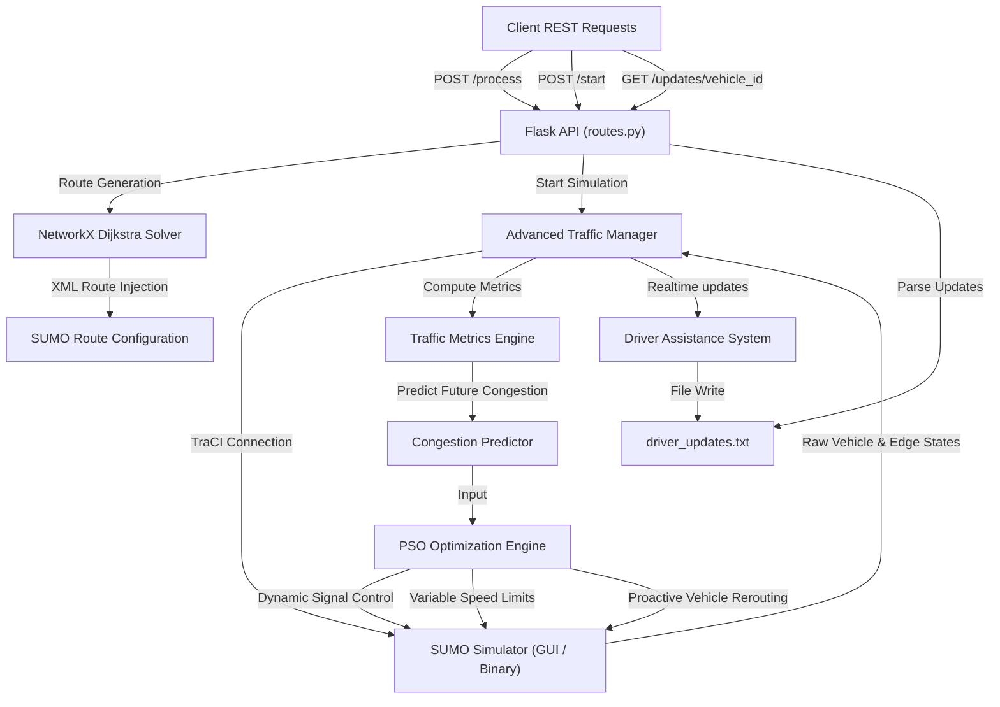

# NexRoute: Urban Traffic Optimization & Route Management

NexRoute is a simulation-in-the-loop Traffic Optimization and Route Management system. It uses a Python-based backend connected to SUMO (Simulation of Urban MObility), NetworkX graph algorithms, and Particle Swarm Optimization (PSO) to simulate urban traffic networks, adjust traffic signals, regulate vehicle speeds, and calculate alternative vehicle routes to manage congestion.

---

## 🎯 Project Objectives & Overview

The objective of NexRoute is to test traffic management strategies dynamically during simulation runs. By interfacing with the SUMO simulator, monitoring vehicle speeds and queues, and running optimization routines, NexRoute:
1. **Reduces vehicle waiting times and travel delays** within the simulation.
2. **Dynamically adjusts green light durations** at signalized intersections based on traffic demand.
3. **Applies speed limit adjustments** on congested roads to smooth vehicle deceleration and flow.
4. **Calculates alternative routes** for vehicles when predicted congestion on their path exceeds a configured threshold.
5. **Provides simulated driver assistance alerts** (upcoming turn warnings and speed suggestions).

---

## 🏗️ System Architecture & Data Flow

The backend is a Flask REST server that interacts with the SUMO simulator through TraCI (Traffic Control Interface). Run metrics (periodic time-series CSV and final summary JSON snapshots) are persisted under the top-level `results/` directory per simulation run.



### Execution Flow:
1. **Route Registration**: Origin and destination edges are received via `POST /process`. The system uses a NetworkX representation of the road network to calculate a route, checks the connections, writes the vehicle route to the XML configuration file, and initializes a vehicle state tracking instance.
2. **Simulation Control**: The simulation is started via `POST /start` in a separate background thread.
3. **Observation Loop**: At each simulation step, the manager uses TraCI to gather vehicle states (`VehicleState`) and edge-level traffic metrics (`TrafficMetrics`).
4. **Optimization Loop**: Every `OPTIMIZATION_INTERVAL` (default: 30 steps), the manager runs PSO routines to adjust traffic light durations, speed limits, and routing weights.
5. **Driver Assistance**: Real-time turn warnings and speed recommendations are written to `driver_updates.txt` for the monitored vehicle.

---

## 🧠 Subsystems & Mathematical Formulations

### 1. Particle Swarm Optimization (PSO) Engine (`optimizer.py`)
The system uses Particle Swarm Optimization (PSO) to search for traffic control parameters. The optimizer attempts to minimize objective functions representing traffic queue lengths and travel delays.

#### Formulation:
For each particle $i$ in the swarm:

- **Velocity Update**:

$$v_i(t+1) = w \cdot v_i(t) + c_1 \cdot r_1 \cdot (p_i - x_i(t)) + c_2 \cdot r_2 \cdot (g - x_i(t))$$

Where:
- $x_i(t)$ is the current parameter configuration vector.
- $v_i(t)$ is the velocity vector.
- $p_i$ is the particle's historical best position.
- $g$ is the swarm's global best position.
- $w$ is the inertia weight, which decays by $w(t+1) = w(t) \cdot 0.99$ at each step.
- $c_1, c_2$ are cognitive and social scaling coefficients (default: $1.8$).
- $r_1, r_2$ are random values drawn from $U(0, 1)$.

- **Position Update & Clamping**:

$$x_i(t+1) = x_i(t) + v_i(t+1)$$

Positions are clamped to stay within the configured parameter bounds.

---

### 2. Dynamic Traffic Light Optimization (`traffic_manager.py`)
The traffic manager uses PSO to adjust phase durations of traffic signals based on monitored queue lengths and flow rates.

- **Objective Function**: Computes a penalty score based on queues, waiting times, vehicle stops, and delays across the controlled lanes.

$$\text{Score}_{\text{signal}} = \sum_{\text{phases}} \left( \frac{\text{Queue}}{\text{Lanes}} \cdot w_q \cdot 2.0 + \frac{\text{WaitingTime}}{\text{FlowRate}} \cdot w_d \cdot 1.5 + \text{StoppedVehicles} \cdot 1.2 + \text{Delays} \cdot 1.3 + (1 - \text{Efficiency}) \cdot 1.5 \right)$$

- **Phase Duration Calculation**: The optimized base green time and weights are used to set the green phase durations:

$$D_{\text{phase}} = D_{\text{green}} + \frac{\text{Flow}}{500} \cdot w_{\text{demand}} + \text{Queue} \cdot w_{\text{queue}} \cdot 2.5 + \text{Stops} \cdot 2.0 + C_{\text{pred}} \cdot 20.0$$

Phase green durations are restricted between `MIN_GREEN_TIME` (20s) and `MAX_GREEN_TIME` (100s).

- **Safety Adjustments**: If the predicted congestion index exceeds $0.65$, yellow phases are extended (up to 1.5x) and all-red phases are introduced to help clear the intersection.

---

### 3. Variable Speed Limits (VSL) & Speed Harmonization (`traffic_manager.py`)
To manage traffic flow on congested links, the manager adjusts maximum edge speeds.

- **Objective Function**: Minimizes density, queue lengths, and speed variance.
- **Speed Clamping**:

$$V_{\text{limit}} = \max\left(3.0, V_{\text{normal}} \cdot \left[ 1.0 - \left( C_{\text{pred}} \cdot 0.5 + F_{\text{queue}} \cdot 0.4 + F_{\text{density}} \cdot 0.3 + F_{\text{stop}} \cdot 0.2 \right) \right]\right)$$

Where $C_{\text{pred}}$ is the predicted congestion index, $V_{\text{normal}}$ is the edge's default speed limit, and $F$ represents normalized traffic factors.

- **Speed Harmonization**: Adjusts trailing vehicle speeds based on headway gaps to prevent sudden braking cycles:

$$V_{\text{target}} = \min(V_{\text{limit}}, V_{\text{lead}} \cdot \text{gap})$$

---

### 4. Proactive Routing & Adaptive Dijkstra Weights (`traffic_manager.py`)
The system calculates route weights using real-time and predicted congestion values rather than static free-flow travel times.

- **Dynamic Weight Function**:

$$W_{\text{edge}} = \left( T_{\text{travel}} \cdot w_t + Q_{\text{delay}} + P_{\text{congestion}} + \text{Stops} \cdot 3.0 \right) \cdot F_{\text{history}} \cdot M_{\text{mult}}$$

Where:
- $T_{\text{travel}} = \frac{\text{Edge Length}}{\text{Mean Speed}}$
- $Q_{\text{delay}} = \text{QueueLength} \cdot 3.0 \cdot w_q \cdot (1.2^{\text{QueueLength}})$ (exponential queue penalty).
- $P_{\text{congestion}} = C_{\text{pred}}^2 \cdot \text{Edge Length} \cdot w_p$.
- $M_{\text{mult}} = 5.0$ if the edge's predicted congestion exceeds the adaptive routing threshold ($0.65$).

- **Routing Optimization**: PSO is used to adjust the weight coefficients ($w_t, w_q, w_p, w_h$) to minimize travel delays. Selected vehicles are rerouted via Dijkstra's shortest path before reaching the congested edges.

---

### 5. Congestion Prediction Model (`traffic_manager.py`)
The system estimates future congestion levels ($C_{\text{pred}}$) on each edge using a linear combination of current and historical metrics:

$$C_{\text{pred}} = 0.25 \cdot C_{\text{curr}} + 0.20 \cdot H_{\text{EMA}} + 0.15 \cdot D_{\text{norm}} + 0.15 \cdot Q_{\text{norm}} + 0.10 \cdot S_{\text{factor}} + 0.10 \cdot O_{\text{norm}} + 0.05 \cdot R_{\text{change}}$$

Where:
- $C_{\text{curr}}$: Current congestion index (flow rate / capacity).
- $H_{\text{EMA}}$: Exponential moving average of congestion history (size = 40).
- $D_{\text{norm}}$: Normalized density (Passenger Car Units / km / lane).
- $Q_{\text{norm}}$: Normalized queue factor.
- $S_{\text{factor}}$: Speed drop factor ($1 - \frac{V_{\text{avg}}}{V_{\text{limit}}}$).
- $O_{\text{norm}}$: Normalized occupancy percentage.
- $R_{\text{change}}$: Rate of congestion change.
- **Downstream Propagation**: The local prediction is blended with downstream edges ($80\%$ local, $20\%$ average downstream prediction) to capture spillback.

---

### 6. Driver Assistance Subsystem (`driver_assistance.py`)
Generates guidance alerts for a monitored vehicle based on its route geometry and traffic metrics.

- **Vector-Based Turn Detection**: Calculates the geometric angle between consecutive edges in the vehicle's route:

$$v_1 = \vec{p}_{\text{end1}} - \vec{p}_{\text{start1}}$$

$$v_2 = \vec{p}_{\text{end2}} - \vec{p}_{\text{start2}}$$

$$\theta = \text{atan2}(v_1 \times v_2, v_1 \cdot v_2)$$

Angles are classified into turn types:
- $|\theta| < 25^\circ$: Straight
- $25^\circ \le \theta < 60^\circ$: Slight Left
- $60^\circ \le \theta < 150^\circ$: Left
- $\theta \ge 150^\circ$: Sharp Left
- (Symmetric negative angles map to Right, Slight Right, and Sharp Right turns).

- **Proactive Speed Guidance**: Suggests travel speeds using queue lengths and congestion indices of the upcoming 3 edges:

$$V_{\text{advice}} = \min(V_{\text{limit}}, V_{\text{congest}})$$

Guidance messages are written to `driver_updates.txt`.

---

## 📂 Backend File & Module Structure

```
backend/
│
├── run.py                          # Flask entrypoint. Initializes app and routes.
├── requirements.txt                # Python package dependencies.
│
└── app/
    ├── __init__.py                 # Package setup and logging initialization.
    ├── config.py                   # System parameters, SUMO configuration paths, PSO defaults, and thresholds.
    ├── models.py                   # Data Classes: VehicleState, TrafficMetrics.
    ├── optimizer.py                # Particle Swarm Optimization core implementation.
    ├── driver_assistance.py        # Vector geometry engine for turn warnings & speed guidance.
    ├── traffic_manager.py          # NetworkX Builder, TraCI Simulation Loop, VSL, Signal Optimization, Congestion Predictor.
    └── routes.py                   # Flask REST API Endpoints.
```

### Module Descriptions:
*   **[`app/config.py`](file:///c:/Users/ghana/OneDrive/Desktop/NexRoute/backend/app/config.py)**: Contains simulation parameters (SUMO config paths), speed limits, Passenger Car Unit (PCU) values (Passenger = 1.0, Truck = 2.3, Bus = 2.2), and signal timing bounds.
*   **[`app/models.py`](file:///c:/Users/ghana/OneDrive/Desktop/NexRoute/backend/app/models.py)**: Defines data structures. `VehicleState` tracks position, speed, route, and waiting time. `TrafficMetrics` stores computed values like density, variance, and predicted congestion.
*   **[`app/optimizer.py`](file:///c:/Users/ghana/OneDrive/Desktop/NexRoute/backend/app/optimizer.py)**: Implements the Particle Swarm Optimization algorithm.
*   **[`app/driver_assistance.py`](file:///c:/Users/ghana/OneDrive/Desktop/NexRoute/backend/app/driver_assistance.py)**: Calculates turn angles from coordinates and outputs turn alerts and speed advice.
*   **[`app/traffic_manager.py`](file:///c:/Users/ghana/OneDrive/Desktop/NexRoute/backend/app/traffic_manager.py)**: Builds the road network graph using NetworkX, computes edge capacities using HCM formulas, runs the TraCI loop, and updates signal timings, speed limits, and routing weights.
*   **[`app/routes.py`](file:///c:/Users/ghana/OneDrive/Desktop/NexRoute/backend/app/routes.py)**: Exposes Flask endpoints to add vehicle routes, start the simulation, and fetch driver updates.

---

## 🛠️ Installation & Setup

### Prerequisites
*   **Python 3.8+**
*   **SUMO (Simulation of Urban MObility)** installed, with the `SUMO_HOME` environment variable configured correctly:
    ```bash
    # On Windows (Example)
    set SUMO_HOME="C:\Program Files (x86)\Eclipse\Sumo"
    set PATH=%PATH%;%SUMO_HOME%\bin
    ```

### Running the Backend Server
1. Navigate to the `backend` directory:
   ```bash
   cd backend
   ```
2. Install Python packages:
   ```bash
   pip install -r requirements.txt
   ```
3. Run the backend server or CLI:
   ```bash
   python run.py [OPTIONS]
   ```
   *The backend runs locally on `http://127.0.0.1:5000` when started in API mode.*

#### Command Line Options
* `--scenario NAME`: Scenario name to load from `backend/scenarios/` (default: `"default"`).
* `--seed INT`: Random seed for Python, NumPy, and SUMO (default: `None`, random each run).
* `--headless`: Force SUMO to launch in non-GUI mode (`sumo` binary instead of `sumo-gui`).
* `--mode {api,batch}`: Execution mode: `api` starts Flask server, `batch` for scripted execution (default: `"api"`).

#### CLI Usage Examples
```bash
# Display help and flag descriptions
python run.py --help

# Run interactive API server with scenario 'default', seed 42, in headless mode
python run.py --scenario default --seed 42 --headless

# Run batch mode
python run.py --mode batch
```

---

## 🔌 API Documentation

### 1. Health Check
* **URL**: `/`
* **Method**: `GET`
* **Response**:
  ```json
  { "message": "Traffic Optimization API is running" }
  ```

### 2. Add Vehicle Route
Calculates a route and injects it into the active SUMO configuration.
* **URL**: `/process`
* **Method**: `POST`
* **Body**:
  ```json
  {
    "initial_location": "edge_id_origin",
    "destination": "edge_id_destination"
  }
  ```
* **Response**:
  ```json
  {
    "status": "success",
    "message": "Vehicle route added successfully",
    "data": {
      "from": "edge_id_origin",
      "to": "edge_id_destination",
      "vehicle_id": "vehicle_numeric_id",
      "route_length": 8,
      "route": ["edge_1", "edge_2", "edge_3", "edge_4", "edge_5", "edge_6", "edge_7", "edge_8"]
    }
  }
  ```

### 3. Start Simulation
Launches the SUMO GUI and begins the simulation thread.
* **URL**: `/start`
* **Method**: `POST`
* **Response**:
  ```json
  {
    "status": "success",
    "message": "Simulation started successfully"
  }
  ```

### 4. Fetch Driver Updates
Polls navigation updates and alerts for a vehicle.
* **URL**: `/updates/<vehicle_id>`
* **Method**: `GET`
* **Response**:
  ```json
  {
    "status": "success",
    "driver_updates": [
      "Prepare to turn left in 42m",
      "Maintain current speed of 12.5 m/s"
    ],
    "vehicle_state": {
      "status": "active",
      "is_arrived": false
    }
  }
  ```
